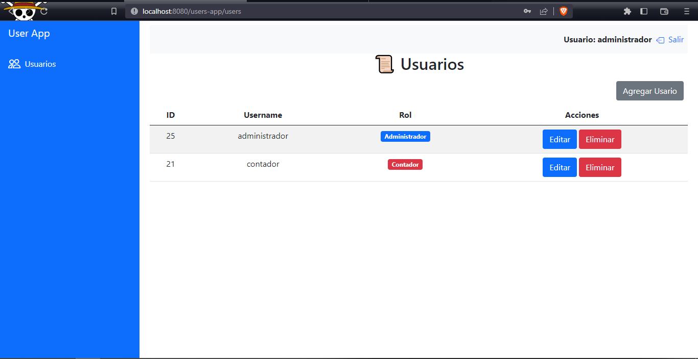
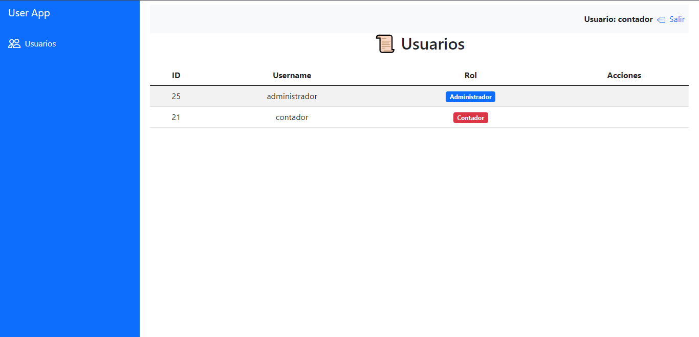

# 👦 Users App 👩

## ⚙ How Use

- Create a new Oracle schema with the name : 'users' and the password 'Root1234'
- Restore the database (make sure you have Oracle 19c)
- Clone Repository
- Open IntelliJ IDEA and select File > Open
- Select File > Project Structure... and ensure that the Project SDK and language level are set to use Java 19
- Right click on the project folder > Maven > Reload Project
- Next to the build project > Edit Configurations > Add New > JBoss/WildFly Server > Local > Put your JBoss/WildFly Server Configuration
- Run Project

### 🔐 Credentials

1. username: administrador -> password: 123
2. username: contador -> password: 123
